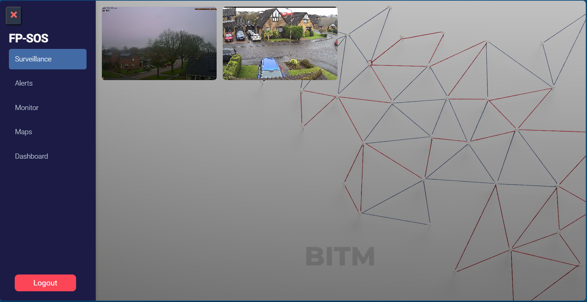
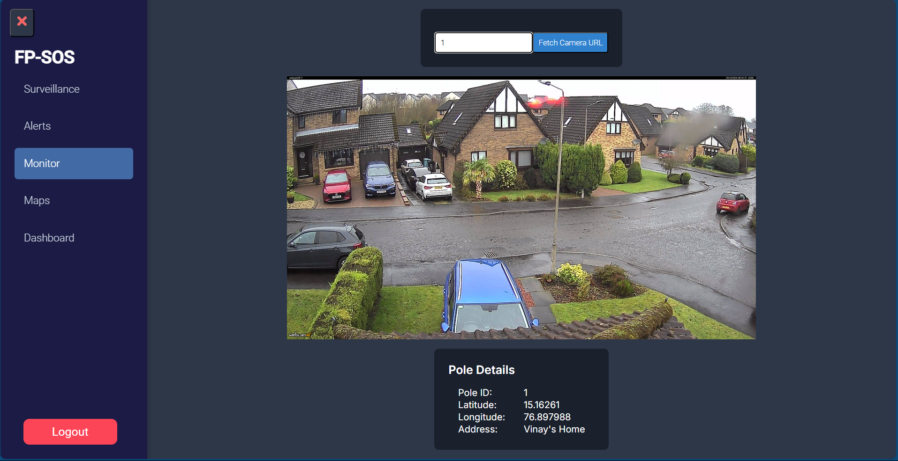
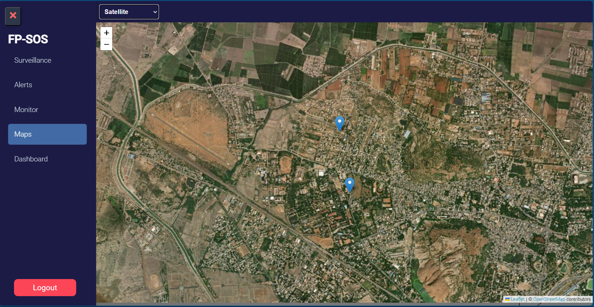
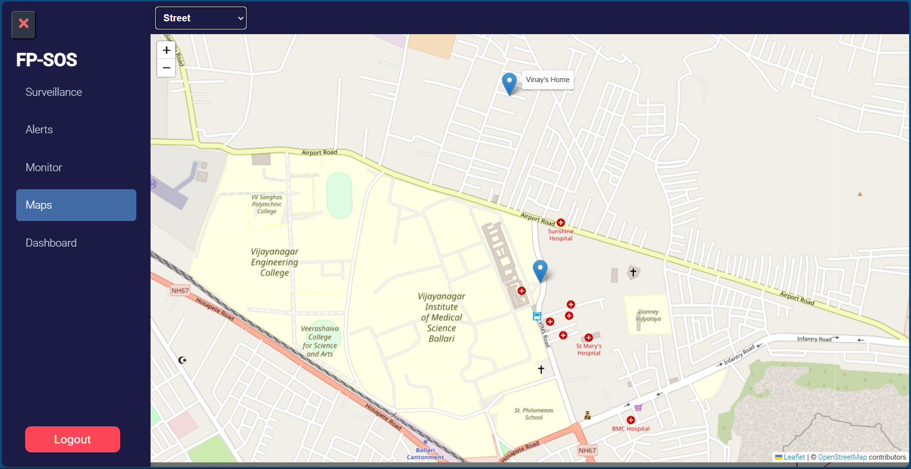
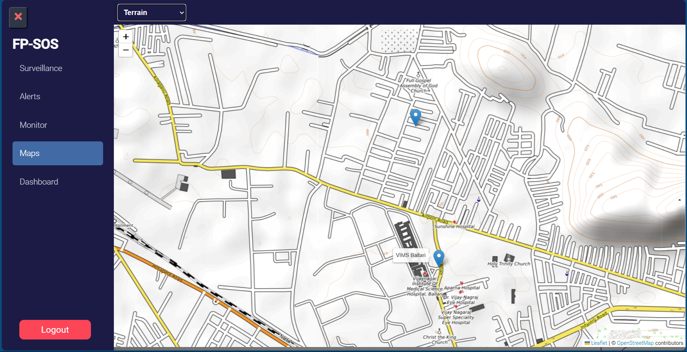
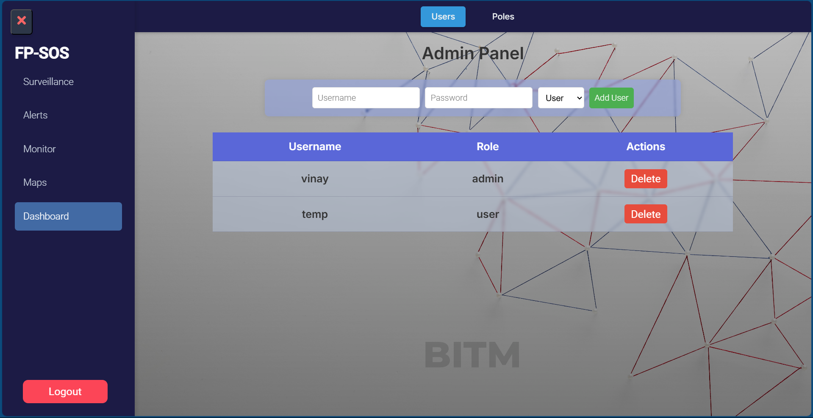
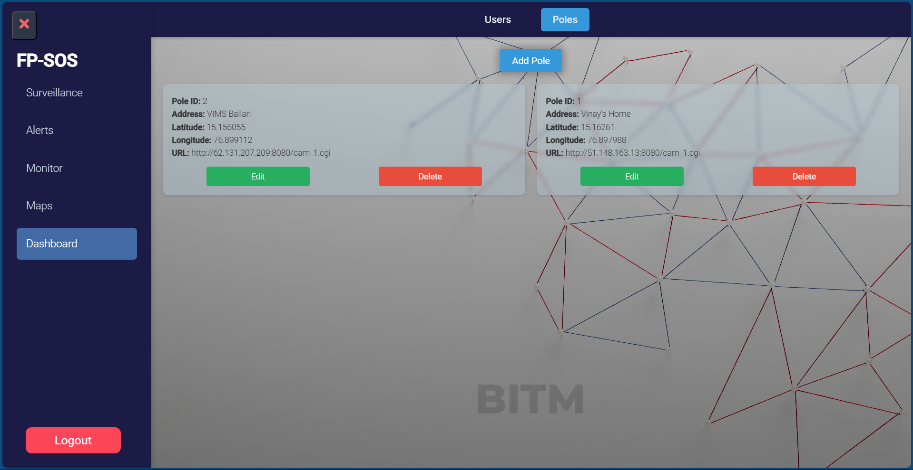

# FP-SOS: Smart Pole Surveillance and SOS Alert System

## Table of Contents
- [Introduction](#introduction)
- [Features](#features)
- [System Architecture](#system-architecture)
- [Technologies Used](#technologies-used)
- [Installation](#installation)
- [Usage](#usage)
- [Project Structure](#project-structure)
- [Future Enhancements](#future-enhancements)
- [Contributors](#contributors)
- [License](#license)

---

## Introduction

FP-SOS is a smart surveillance solution designed for streetlight poles equipped with ESP32-CAM modules and SOS buttons. It provides real-time video streaming, dynamic alert management, and a responsive web interface for efficient monitoring. When an SOS button is pressed, an alert is triggered, and the associated live camera feed is highlighted for prompt action. 

This project aims to enhance public safety by enabling efficient monitoring and quick response to emergency situations.

---

## Features

- **Surveillance Grid**: View live feeds from all cameras in a grid format with status indicators.
- **Search Functionality**: Quickly locate a specific pole's camera feed by entering its unique Pole ID.
- **SOS Alert Management**: Highlight and prioritize live feeds from poles with active SOS alerts.
- **Custom Camera View**: View detailed live video of a specific pole by selecting its Pole ID.
- **Real-Time Data Handling**: Efficient WebSocket integration ensures real-time updates.
- **Responsive Design**: The interface adapts seamlessly to different screen sizes for optimal usability.
- **Authentication**: Basic security layer to restrict unauthorized access within a local network.

---

## System Architecture

1. **Hardware Components**:
   - ESP32-CAM modules for live video streaming.
   - SOS buttons for emergency alerts.
   - Mounted streetlight poles with unique Pole IDs.

2. **Backend**:
   - Node.js server to handle WebSocket connections and manage dynamic URLs for camera feeds.

3. **Frontend**:
   - React.js application for user interface, supporting live video, alerts, and search functionality.

4. **Networking**:
   - Local network hosted via a mobile hotspot for private communication between devices.

---

## Technologies Used

- **Frontend**: React.js, TailwindCSS
- **Backend**: Node.js, Express
- **Streaming**: HHTP Frame transfer over IP
- **Networking**: WebSocket for real-time communication
- **Authentication**: Basic HTTP authentication
- **Deployment**: Render.com

---

## Installation

### Prerequisites
- Node.js installed on your system
- ESP32-CAM modules configured with your local network
- A mobile hotspot for local communication
- A browser supporting MJPEG streams

### Steps
1. Clone the repository:
   ```bash
   git clone https://github.com/yourusername/fp-sos.git
   cd fp-sos
   ```
2. Install dependencies:
   ```bash
   npm install
   ```
3. Start the backend server:
   ```bash
   npm start
   ```
4. Start the React application:
   ```bash
   cd client
   npm install
   npm start
   ```
5. Access the application in your browser at `http://localhost:3000`.

---

## Usage

1. **Surveillance Grid**:
   - Navigate to the Surveillance Grid page to view live feeds from all connected cameras.

2. **Search by Pole ID**:
   - Use the search bar to filter and view the live feed of a specific pole by its unique Pole ID.

3. **SOS Alerts**:
   - When an SOS button is pressed, the corresponding live feed appears on the Alerts Page for 10 minutes.
   - The stream is automatically recorded for review.

4. **Custom Camera View**:
   - Enter a Pole ID to access the live feed of a specific camera.

---

## Project Structure

```
fp-sos/
├── backend/
│   ├── server.js          # Node.js server with WebSocket handling
│   ├── routes/            # API routes for camera and alert management
├── client/
│   ├── src/
│   │   ├── components/    # React components for UI
│   │   ├── pages/         # Surveillance, Alerts, and Custom Camera pages
│   ├── App.js             # Main React application
├── README.md              # Project documentation
```

---
## Screenshots 


 

 

 








## Future Enhancements

- Add advanced authentication using JWT.
- Integrate face recognition for capturing faces during SOS events.
- Enable cloud storage for recorded videos.
- Expand to support more cameras and larger networks.
- Implement AI-based anomaly detection for automated alerts.

---

## Contributors

- **Vinay B** - Softwware Development
- **Srinivas S** - Hardware Designing
- **Vishwas** - UI designing
- **Prashanth Kumar D** - Mechanical designing
---
